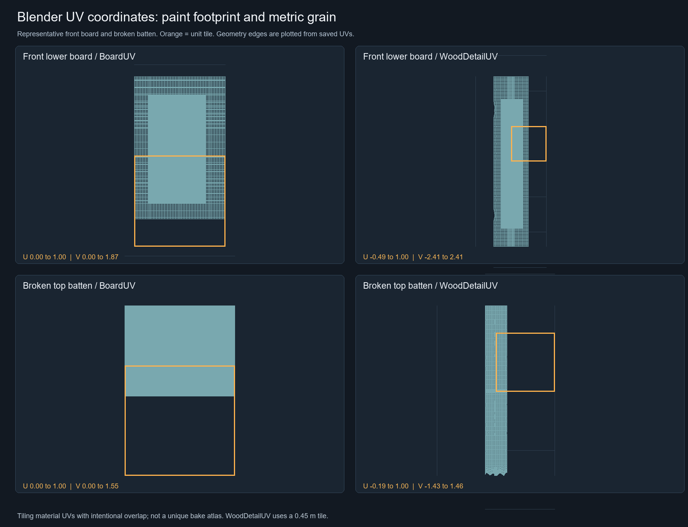
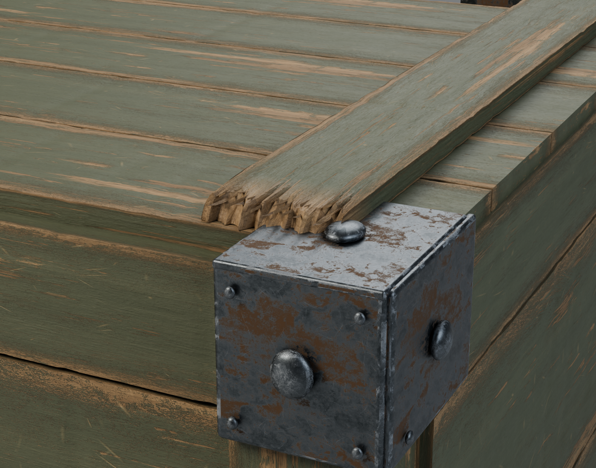
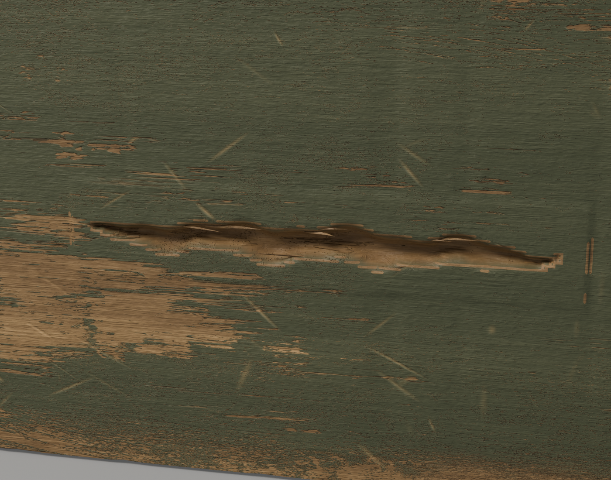

# Weathered crate: Blender modeling and Designer materials

A Codex-generated reference guided this 2.2 m crate. Blender provides the
editable geometry, layered broken battens, 59 attached wood fibers, UVs,
lighting and Cycles rendering. Substance 3D Designer provides the procedural
paint, grain, scratches and rust. Four corner supports meet the studio floor.

[Packed Blender scene](https://raw.githubusercontent.com/dcc-mcp/dcc-mcp-substance3d-designer/f81044b311e712883ece3a32733fb63215f091ae/docs/showcase/crate-lookdev/crate.blend) ·
[Editable SBS/SBSAR, exported maps and full node workflows](https://github.com/dcc-mcp/dcc-mcp-substance3d-designer/blob/f81044b311e712883ece3a32733fb63215f091ae/docs/showcase/crate-lookdev/README.md) ·
[Reference image](https://github.com/dcc-mcp/dcc-mcp-substance3d-designer/blob/f81044b311e712883ece3a32733fb63215f091ae/docs/showcase/painted-wood/reference.png) ·
[Scene validation](https://github.com/dcc-mcp/dcc-mcp-substance3d-designer/blob/f81044b311e712883ece3a32733fb63215f091ae/docs/showcase/crate-lookdev/validation.json) · [Image provenance](provenance.json)

## UV coordinates and checker

| Actual UV coordinates | Checker rendered on the model |
| --- | --- |
|  |  |

`BoardUV` retains each board's paint-wear footprint. `WoodDetailUV` uses one
tile per 0.45 m for consistent fine-grain density. The coordinate plot shows
the lower front board and one batten; the checker shows the whole model.
These UVs intentionally tile and overlap. This is a dense lookdev scene,
not a unique baking atlas or game-ready retopology.

## Broken wood and metal reflections

Large breaks and lifted fibers use geometry. Both battens additionally use
native 16-bit SD Height and Grain Detail in true Cycles displacement with
two levels of Simple subdivision. Other boards use normal and bump maps.
Separate steel, rust and scratch roughness reveals metal reflections.

The saved scene reopens in Blender 5.2 with 178 UV-bearing meshes and 13
packed images whose bytes match the exported maps. The beauty render uses
128 Cycles samples. This is an artistic reconstruction of a lit reference;
damage placement and dimensions are estimates. Images here are unchanged
copies of the validated source revision above.
